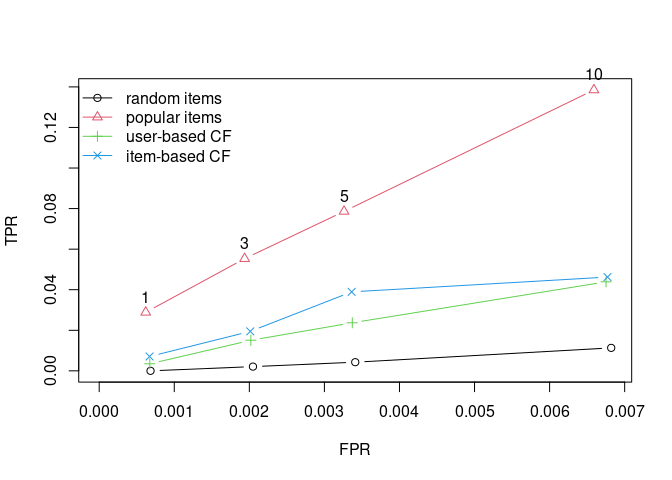

#  R package recommenderlab - Lab for Developing and Testing Recommender Algorithms

[](https://CRAN.R-project.org/package=recommenderlab)
[](https://mhahsler.r-universe.dev/recommenderlab)
[](https://CRAN.R-project.org/package=recommenderlab)

Provides a research infrastructure to develop and evaluate collaborative
filtering recommender algorithms. This includes a sparse representation
for user-item matrices, many popular algorithms, top-N recommendations,
and cross-validation. The package supports rating (e.g., 1-5 stars) and
unary (0-1) data sets. Supported algorithms are:

- User-based collaborative filtering (**UBCF**)
- Item-based collaborative filtering (**IBCF**)
- SVD with column-mean imputation (**SVD**)
- Funk SVD (**SVDF**)
- Alternating Least Squares (**ALS**)
- Matrix factorization with LIBMF (**LIBMF**)
- Association rule-based recommender (**AR**)
- Popular items (**POPULAR**)
- Randomly chosen items for comparison (**RANDOM**)
- Re-recommend liked items (**RERECOMMEND**)
- Hybrid recommendations (**HybridRecommender**)

For evaluation, the framework supports given-n and all-but-x protocols
with

- Train/test split
- Cross-validation
- Repeated bootstrap sampling

Evaluation measures are/:

- Rating errors: MSE, RMSE, MAE
- Top-N recommendations: TPR/FPR (ROC), precision and recall

## Installation

**Stable CRAN version:** Install from within R with

``` r
install.packages("recommenderlab")
```

**Current development version:** Install from
[r-universe.](https://mhahsler.r-universe.dev/recommenderlab)

``` r
install.packages("recommenderlab", repos = "https://mhahsler.r-universe.dev")
```

## Usage

Load the package and prepare a dataset (included in the package). The
MovieLense data contains user ratings for movies on a 1 to 5 star scale.
We only use here users with more than 100 ratings.

``` r
set.seed(1234)

library("recommenderlab")
data("MovieLense")

MovieLense100 <- MovieLense[rowCounts(MovieLense) > 100, ]
MovieLense100
```

    ## 358 x 1664 rating matrix of class 'realRatingMatrix' with 73610 ratings.

Train a user-based collaborative filtering recommender using a small
training set.

``` r
train <- MovieLense100[1:300]
rec <- Recommender(train, method = "UBCF")
rec
```

    ## Recommender of type 'UBCF' for 'realRatingMatrix' 
    ## learned using 300 users.

Create top-N recommendations for new users (users 301 and 302).

``` r
pre <- predict(rec, MovieLense100[301:302], n = 5)
pre
```

    ## Recommendations as 'topNList' with n = 5 for 2 users.

``` r
as(pre, "list")
```

    ## $`0`
    ## [1] "Amistad (1997)"                    "Kama Sutra: A Tale of Love (1996)"
    ## [3] "Farewell My Concubine (1993)"      "Roommates (1995)"                 
    ## [5] "Fresh (1994)"                     
    ## 
    ## $`1`
    ## [1] "Bitter Moon (1992)"         "Touch of Evil (1958)"      
    ## [3] "Braindead (1992)"           "Great Dictator, The (1940)"
    ## [5] "M (1931)"

Use a 10-fold cross-validation scheme to compare the top-N lists of
several algorithms. Movies with 4 or more stars are considered a good
recommendation. We plot true negative vs. true positive rate for top-N
lists of different lengths.

``` r
scheme <- evaluationScheme(MovieLense100, method = "cross-validation", k = 10, given = -5,
    goodRating = 4)
scheme
```

    ## Evaluation scheme using all-but-5 items
    ## Method: 'cross-validation' with 10 run(s).
    ## Good ratings: >=4.000000
    ## Data set: 358 x 1664 rating matrix of class 'realRatingMatrix' with 73610 ratings.

``` r
algorithms <- list(`random items` = list(name = "RANDOM", param = NULL), `popular items` = list(name = "POPULAR",
    param = NULL), `user-based CF` = list(name = "UBCF", param = list(nn = 3)), `item-based CF` = list(name = "IBCF",
    param = list(k = 100)))

results <- evaluate(scheme, algorithms, type = "topNList", n = c(1, 3, 5, 10), progress = FALSE)

plot(results, annotate = 2, legend = "topleft")
```

<!-- -->

## Shiny App

A simple Shiny App running recommenderlab can be found at
<https://mhahsler-apps.shinyapps.io/Jester/> ([source
code](https://github.com/mhahsler/recommenderlab/tree/master/Work/apps)).

## References

- Michael Hahsler (2022) recommenderlab: An R framework for developing
  and testing recommendation algorithms. arXiv:2205.12371 \[cs.IR\].
  DOI:
  [10.48550/arXiv.2205.12371](https://doi.org/10.48550/arXiv.2205.12371).
- recommenderlab [reference
  manual](https://CRAN.R-project.org/package=recommenderlab/recommenderlab.pdf)
- Suresh K. Gorakala and Michele Usuelli (2015) [Building a
  Recommendation System with
  R](https://www.amazon.com/Building-Recommendation-System-Suresh-Gorakala/dp/1783554495)
  (Packt Publishing) features the package recommenderlab.
