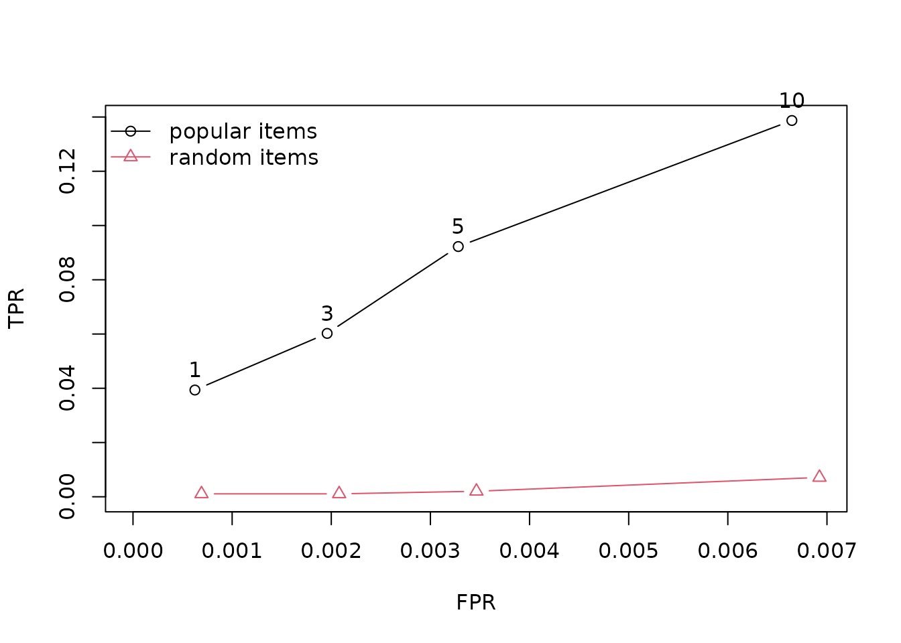

# Getting started with recommenderlab

`recommenderlab` provides tools for representing user–item data, fitting
recommendation algorithms, producing recommendations, and evaluating
their quality. This vignette walks through that workflow using the
package’s bundled MovieLense ratings data.

## Installation

Install the released package from CRAN, then load it in your R session:

``` r

install.packages("recommenderlab")
```

``` r

library(recommenderlab)
```

## Load and prepare ratings

The `MovieLense` data contains ratings on a one-to-five-star scale. It
is stored as a sparse `realRatingMatrix`: users are rows, movies are
columns, and missing ratings are not stored as zeros. We select users
who rated more than 100 movies to give the recommendation algorithms
enough information to work with.

``` r

data("MovieLense")
MovieLense
#> 943 x 1664 rating matrix of class 'realRatingMatrix' with 99392 ratings.

MovieLense100 <- MovieLense[rowCounts(MovieLense) > 100, ]
MovieLense100
#> 358 x 1664 rating matrix of class 'realRatingMatrix' with 73610 ratings.
```

Basic summaries help describe the data before modeling. For example,
[`rowCounts()`](http://michael.hahsler.net/recommenderlab/reference/ratingMatrix-class.md)
counts ratings per user, and
[`getRatings()`](http://michael.hahsler.net/recommenderlab/reference/ratingMatrix-class.md)
extracts the observed rating values.

``` r

summary(rowCounts(MovieLense100))
#>    Min. 1st Qu.  Median    Mean 3rd Qu.    Max. 
#>   101.0   134.0   180.5   205.6   251.0   735.0
summary(getRatings(MovieLense100))
#>    Min. 1st Qu.  Median    Mean 3rd Qu.    Max. 
#>   1.000   3.000   4.000   3.493   4.000   5.000
```

## Fit a recommender and make recommendations

[`Recommender()`](http://michael.hahsler.net/recommenderlab/reference/Recommender.md)
learns a model from a training rating matrix. Here we fit user-based
collaborative filtering (UBCF) on the first 300 selected users.
[`predict()`](http://michael.hahsler.net/recommenderlab/reference/predict.md)
then produces a top-five list for two other users. The default output is
a `topNList`; coerce it to a list to see the recommended movie titles.

``` r

train <- MovieLense100[1:300, ]
rec <- Recommender(train, method = "UBCF")
rec
#> Recommender of type 'UBCF' for 'realRatingMatrix' 
#> learned using 300 users.

recommendations <- predict(rec, MovieLense100[301:302, ], n = 5)
recommendations
#> Recommendations as 'topNList' with n = 5 for 2 users.
as(recommendations, "list")
#> $`0`
#> [1] "Amistad (1997)"                    "Kama Sutra: A Tale of Love (1996)"
#> [3] "Farewell My Concubine (1993)"      "Roommates (1995)"                 
#> [5] "Fresh (1994)"                     
#> 
#> $`1`
#> [1] "Bitter Moon (1992)"         "Touch of Evil (1958)"      
#> [3] "Braindead (1992)"           "Great Dictator, The (1940)"
#> [5] "M (1931)"
```

The package also supports predicted ratings. Request `type = "ratings"`
when the numeric estimates are more useful than a ranked list.

``` r

predicted_ratings <- predict(
  rec,
  MovieLense100[301:302, ],
  type = "ratings"
)
as(predicted_ratings, "matrix")[, 1:6]
#>     Toy Story (1995) GoldenEye (1995) Four Rooms (1995) Get Shorty (1995)
#> 798               NA               NA          3.074900          3.679378
#> 804               NA               NA          3.302592                NA
#>     Copycat (1995) Shanghai Triad (Yao a yao yao dao waipo qiao) (1995)
#> 798       3.339132                                                   NA
#> 804       3.450267                                             4.062663
```

## Evaluate recommendations

Evaluation should simulate the information available when
recommendations are made. An all-but-five scheme withholds five ratings
per user and uses the remaining ratings as known input. Here, ratings of
four stars or higher count as positive feedback.
[`evaluationScheme()`](http://michael.hahsler.net/recommenderlab/reference/evaluationScheme.md)
supports train/test splits, cross-validation, and bootstrap evaluation.

``` r

evaluation_data <- MovieLense100[1:200, ]
scheme <- evaluationScheme(
  evaluation_data,
  method = "cross-validation",
  k = 5,
  given = -5,
  goodRating = 4
)
scheme
#> Evaluation scheme using all-but-5 items
#> Method: 'cross-validation' with 5 run(s).
#> Good ratings: >=4.000000
#> Data set: 200 x 1664 rating matrix of class 'realRatingMatrix' with 43480 ratings.
```

Compare a popularity-based recommender with a random baseline.
[`evaluate()`](http://michael.hahsler.net/recommenderlab/reference/evaluate.md)
fits each method on every training fold, creates top-N recommendations,
and calculates measures from the withheld ratings. The resulting
true-positive and false-positive rates can be plotted to compare
recommendation list lengths.

``` r

algorithms <- list(
  `popular items` = list(name = "POPULAR", param = NULL),
  `random items` = list(name = "RANDOM", param = NULL)
)

results <- evaluate(
  scheme,
  algorithms,
  type = "topNList",
  n = c(1, 3, 5, 10),
  progress = FALSE
)
getResults(results[[1]])
#> [[1]]
#>         TP    FP    FN       TN        N precision     recall        TPR
#> [1,] 0.100 0.900 2.400 1455.225 1458.625     0.100 0.04341737 0.04341737
#> [2,] 0.150 2.850 2.350 1453.275 1458.625     0.050 0.06302521 0.06302521
#> [3,] 0.275 4.725 2.225 1451.400 1458.625     0.055 0.10469188 0.10469188
#> [4,] 0.400 9.600 2.100 1446.525 1458.625     0.040 0.16547619 0.16547619
#>               FPR  n
#> [1,] 0.0006196128  1
#> [2,] 0.0019622157  3
#> [3,] 0.0032568396  5
#> [4,] 0.0066193277 10
#> 
#> [[2]]
#>         TP    FP    FN      TN        N precision     recall        TPR
#> [1,] 0.075 0.925 2.775 1424.50 1428.275    0.0750 0.02205882 0.02205882
#> [2,] 0.075 2.925 2.775 1422.50 1428.275    0.0250 0.02205882 0.02205882
#> [3,] 0.125 4.875 2.725 1420.55 1428.275    0.0250 0.03921569 0.03921569
#> [4,] 0.225 9.775 2.625 1415.65 1428.275    0.0225 0.06062092 0.06062092
#>              FPR  n
#> [1,] 0.000655499  1
#> [2,] 0.002070591  3
#> [3,] 0.003451584  5
#> [4,] 0.006918240 10
#> 
#> [[3]]
#>         TP    FP    FN       TN        N precision     recall        TPR
#> [1,] 0.100 0.900 2.600 1447.175 1450.775    0.1000 0.03774510 0.03774510
#> [2,] 0.150 2.850 2.550 1445.225 1450.775    0.0500 0.04719888 0.04719888
#> [3,] 0.300 4.700 2.400 1443.375 1450.775    0.0600 0.08410364 0.08410364
#> [4,] 0.475 9.525 2.225 1438.550 1450.775    0.0475 0.13382353 0.13382353
#>               FPR  n
#> [1,] 0.0006251225  1
#> [2,] 0.0019765956  3
#> [3,] 0.0032608856  5
#> [4,] 0.0066095752 10
#> 
#> [[4]]
#>         TP    FP    FN       TN      N  precision     recall        TPR
#> [1,] 0.125 0.875 2.775 1455.525 1459.3 0.12500000 0.06306306 0.06306306
#> [2,] 0.275 2.725 2.625 1453.675 1459.3 0.09166667 0.10360360 0.10360360
#> [3,] 0.325 4.675 2.575 1451.725 1459.3 0.06500000 0.11081081 0.11081081
#> [4,] 0.500 9.500 2.400 1446.900 1459.3 0.05000000 0.17027027 0.17027027
#>               FPR  n
#> [1,] 0.0006031081  1
#> [2,] 0.0018745738  3
#> [3,] 0.0032169745  5
#> [4,] 0.0065436772 10
#> 
#> [[5]]
#>         TP    FP    FN       TN        N precision     recall        TPR
#> [1,] 0.100 0.900 2.600 1457.425 1461.025     0.100 0.03047619 0.03047619
#> [2,] 0.225 2.775 2.475 1455.550 1461.025     0.075 0.06527211 0.06527211
#> [3,] 0.325 4.675 2.375 1453.650 1461.025     0.065 0.12241497 0.12241497
#> [4,] 0.500 9.500 2.200 1448.825 1461.025     0.050 0.16336735 0.16336735
#>               FPR  n
#> [1,] 0.0006194192  1
#> [2,] 0.0019080457  3
#> [3,] 0.0032188640  5
#> [4,] 0.0065393882 10
```

Plot the average true-positive rate against the false-positive rate for
each recommendation list length:

``` r

plot(results, annotate = TRUE, legend = "topleft")
```



For predicted ratings,
[`evaluate()`](http://michael.hahsler.net/recommenderlab/reference/evaluate.md)
can instead report rating error measures such as RMSE, MSE, and MAE by
using `type = "ratings"`. See
[`?calcPredictionAccuracy`](http://michael.hahsler.net/recommenderlab/reference/calcPredictionAccuracy.md)
for the measures available for direct predictions and
[`?evaluate`](http://michael.hahsler.net/recommenderlab/reference/evaluate.md)
for details on evaluation results.

## Where to go next

The package includes additional algorithms such as item-based
collaborative filtering (IBCF), matrix factorization, association-rule
recommenders, and hybrid recommenders. Use
`recommenderRegistry$get_entry_names()` to see the methods available in
your installation. The reference manual documents each algorithm, data
class, and evaluation helper.
